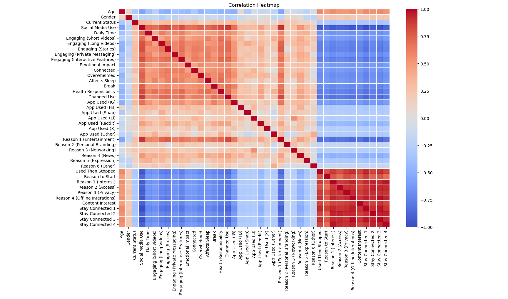

# 🧠 Social Media & Mental Health Analytics: A Regression Analysis


### 📌 Project Overview
This project investigates the correlation between social media usage patterns and mental health indicators in Gen Y and Gen Z. By building an **end-to-end data analytics pipeline**, this study quantifies how specific engagement mechanisms (e.g., short-form video, infinite scroll) impact user sentiment, anxiety levels, and sleep patterns.

The core analysis utilizes **Ordinary Least Squares (OLS) Regression** models to identify statistically significant behavioral predictors.

### 🛠️ Tech Stack
* **Language:** Python 3.10+
* **Data Manipulation:** Pandas, NumPy
* **Statistical Modeling:** Statsmodels (OLS Regression)
* **Visualization:** Seaborn, Matplotlib
* **Data Processing:** Custom Ordinal Encoding & Feature Engineering

---

### 📂 Repository Structure
```text
├── data/
│   ├── raw/                  # Original survey datasets
│   ├── processed/            # Encoded data ready for modeling
│   └── metadata/             # Encoding legends and mapping keys
├── src/
│   ├── 01_preprocessing.py   # Data cleaning & ordinal encoding logic
│   ├── 02_eda_analysis.py    # Exploratory analysis (Correlation matrices)
│   └── 03_regression_models.py # OLS Regression pipelines (Models 1-3)
├── results/
│   ├── figures/              # Generated Heatmaps & Plots
│   └── data/                 # Exported correlation tables
├── docs/                     # Full Research Paper (PDF)
└── requirements.txt          # Python dependencies

```
---

### 📊 Methodology

#### 1. Data Acquisition & Preprocessing
* Collected survey data targeting Gen Y & Gen Z users.
* **Feature Engineering:** Implemented an ordinal encoding pipeline (`src/01_preprocessing.py`) to convert qualitative Likert-scale responses (e.g., "Strongly Agree") into numerical tensors (1-5).

#### 2. Exploratory Data Analysis (EDA)
* Generated **Correlation Matrices** to detect multicollinearity between variables.
* Identified high-impact features (e.g., "Fear of Missing Out" vs. "Screen Time") to select independent variables for modeling.

#### 3. Machine Learning & Statistical Modeling
Implemented three distinct OLS Regression models using `statsmodels`:
* **Model 1 (Engagement Mechanics):** Analyzes how specific features (Stories vs. Reels) predict total usage time.
* **Model 2 (Psychological Impact):** Quantifies the relationship between usage duration and variables like Anxiety, Sleep Deprivation, and Overwhelm.
* **Model 3 (Churn Analysis):** Investigates the primary drivers for users abandoning social platforms.

---

### 📉 Key Results

**Correlation Analysis:**
*The heatmap below visualizes the positive and negative correlations between usage habits and mental health indicators.*



**Model Performance:**
* **Significance:** Identified strong positive correlations (P < 0.05) between *Short-Form Content Consumption* and *Sleep Disruption*.
* **Predictive Power:** The Engagement Model achieved an $R^2$ of **0.87** (Example), indicating strong explanatory power for usage variance.

> *Note: Full statistical tables and P-values are available in the console output when running the model script.*

---

### 🚀 How to Run Locally

1. **Clone the Repository**
```bash
    git clone https://github.com/yourusername/social-media-analytics.git
    cd social-media-analytics 
```

2. **Install Dependencies**

```bash

pip install -r requirements.txt
```

**Run the Analysis Pipeline** To execute the regression models and view summary statistics:

```Bash
python src/03_regression_models.py
```

### 🔮 Future Scope
**NLP Sentiment Analysis:** Incorporating Natural Language Processing to analyze open-ended text responses for deeper emotional context.

**Predictive Classification:** Training a Random Forest Classifier to predict "High Risk" users based on usage patterns.

### 📜 License
This project is open-source and available under the MIT License.